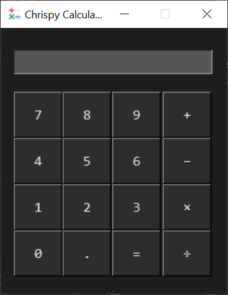

# tkinter-calculator
  
This is my first application using Tkinter. It is a basic calculator where the user can add, subtract, multiply and divide numbers.

## Motivation
I was learning about Tkinter as part of university, and I wanted to try making an application based on the information I had learnt. By this point, I had an introduction to Tkinter and its grid system. I had also learnt how to create buttons, labels and entry boxes. I wanted to practise what I learnt and learn more while building the application. I was learning from the tutorial by freeCodeCamp (https://www.youtube.com/watch?v=YXPyB4XeYLA&t=2331s).

## Tech/Framework Used
Tkinter - a standard library in Python to make applications with GUIs.

## Installation
- Clone the project via your terminal: `https://github.com/cBridges851/tkinter-calculator.git`
- In your terminal, execute `python renderer.py` to open it

## How To Use
- When the application has opened, you should see the interface looking like this:  

- Make an input by pressing on the buttons and press equals to get a result.
